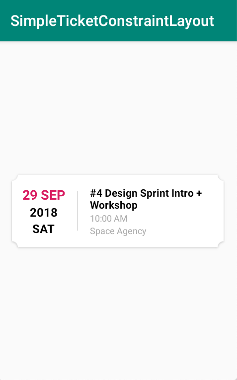
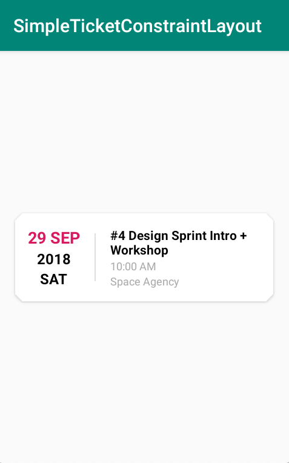

# SimpleTicketConstraintLayout

[](https://jitpack.io/#trieulh-ict/SimpleTicketConstraintLayout)

Custom ConstraintLayout that helps you create a flexible ticket background UI in ease.

It is an open source project, feel free to fork and customize it.

### Some basic features:

- Creata ticket with **TRIANGLE** or **ROUND** corner
- Adjust Inner Radius for the corner
- Adjust Shadow size and Shadow color

 

# Usage

```kotlin
<io.trieulh.simpleticketconstraintlayout.SimpleTicketConstraintLayout
        android:layout_width="match_parent"
        android:layout_height="wrap_content"
        android:layout_margin="16dp"
        android:layout_marginBottom="586dp"
        app:corner_type="TRIANGLE"
        app:inner_corner_radius="8dp"
        app:shadow_radius="2dp"
        app:shadow_color="#e0e0e0">

        ...

</io.trieulh.simpleticketconstraintlayout.SimpleTicketConstraintLayout>
```

# Attributes

| Atribute              | Value Type           | Description                                                             |
| --------------------- | -------------------- | ----------------------------------------------------------------------- |
| _inner_corner_radius_ | Dimension            | Dimension value of Inner Radius (Default is 0)                          |
| _corner_type_         | Enum(ROUND,TRIANGLE) | Corner type (Default is ROUND)                                          |
| _shadow_radius_       | Dimension            | Dimension value of Shadow Radius (Default is 0)                         |
| _shadow_color_        | Color Int            | Color code for Shadow Color (Default is Color.argb(200, 200, 200, 200)) |

# License

MIT License

Copyright (c) 2019 Tristan Le

Permission is hereby granted, free of charge, to any person obtaining a copy of this software and associated documentation files (the "Software"), to deal in the Software without restriction, including without limitation the rights to use, copy, modify, merge, publish, distribute, sublicense, and/or sell copies of the Software, and to permit persons to whom the Software is furnished to do so, subject to the following conditions:

The above copyright notice and this permission notice shall be included in all copies or substantial portions of the Software.

THE SOFTWARE IS PROVIDED "AS IS", WITHOUT WARRANTY OF ANY KIND, EXPRESS OR IMPLIED, INCLUDING BUT NOT LIMITED TO THE WARRANTIES OF MERCHANTABILITY, FITNESS FOR A PARTICULAR PURPOSE AND NONINFRINGEMENT. IN NO EVENT SHALL THE AUTHORS OR COPYRIGHT HOLDERS BE LIABLE FOR ANY CLAIM, DAMAGES OR OTHER LIABILITY, WHETHER IN AN ACTION OF CONTRACT, TORT OR OTHERWISE, ARISING FROM, OUT OF OR IN CONNECTION WITH THE SOFTWARE OR THE USE OR OTHER DEALINGS IN THE SOFTWARE.
